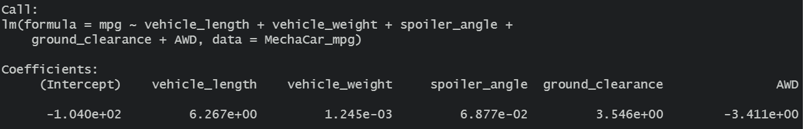
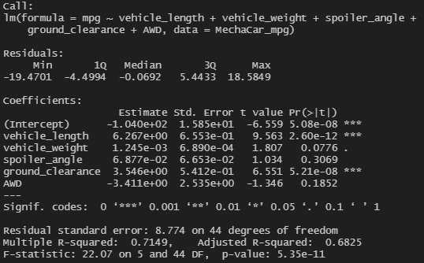

# MechaCar_Statistical_Analysis

All the analyses below are established on the assumption that the significance level is 0.05. 

## 1. Linear Regression to Predict MPG

The R-squared value: 0.7149

Variables|P-values
---------|--------------
vehicle_length|2.60e-12
vehicle_weight|0.0776 
spoiler_angle|0.3069    
ground_clearance|5.21e-08
AWD|0.1852

 - Which variables/coefficients provided a non-random amount of variance to the mpg values in the dataset?
   - After conducting the multiple linear regression analysis on the dataset, the P-values of all independent variables were obtained. The P-values of vehicle_length and ground_clearance are smaller than the significance level we defined (0.05). Therefore, it can be concluded that vehicle_length and ground_clearance provided a non-random amount of variance to the mpg values in the dataset. The results are shown in the images above. 

