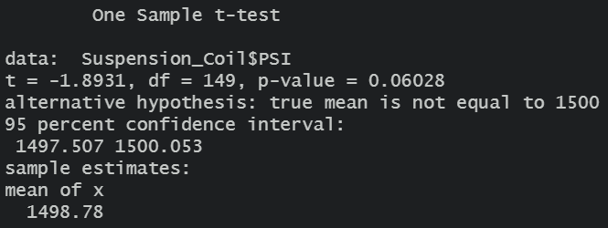
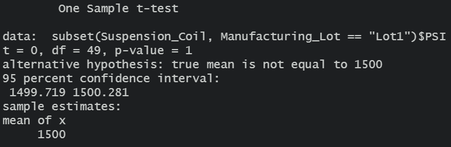
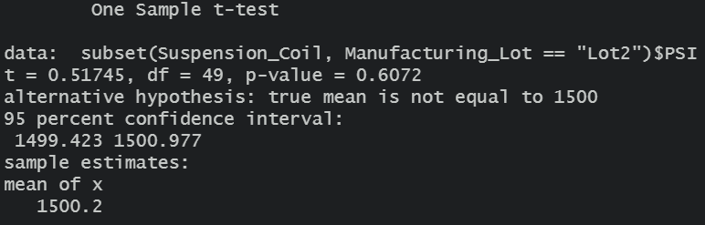
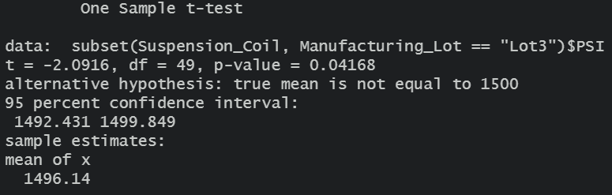

# MechaCar_Statistical_Analysis

All the analyses below are established on the assumption that the significance level is 0.05. 

## Linear Regression to Predict MPG

The R-squared value: 0.7149

Variables|P-values
---------|--------------
vehicle_length|2.60e-12
vehicle_weight|0.0776 
spoiler_angle|0.3069    
ground_clearance|5.21e-08
AWD|0.1852

 - Which variables/coefficients provided a non-random amount of variance to the mpg values in the dataset?
   - After conducting the multiple linear regression analysis on the dataset, the P-values of all independent variables were obtained. The P-values of vehicle_length and ground_clearance are smaller than the significance level we defined (0.05). Therefore, it can be concluded that vehicle_length and ground_clearance provided a non-random amount of variance to the mpg values in the dataset. The results are shown in the images above. 

- Is the slope of the linear model considered to be zero? Why or why not?
  - The slope of the linear model is not zero because the P-values of vehicle_length and ground_clearance are smaller than the significance level we defined (0.05). The coefficients of these two variables are 6.267 and 3.546, respectively.

- Does this linear model predict mpg of MechaCar prototypes effectively? Why or why not?
  -  The R-squared value of this model is 0.7149 which means there is a strong correlation between the model and the dataset. Therefore, this linear model can effectively predict mpg of MechaCar prototypes.

## Summary Statistics on Suspension Coils

Total Summary:

Lot Summary:

- The design specifications for the MechaCar suspension coils dictate that the variance of the suspension coils must not exceed 100 pounds per square inch. Does the current manufacturing data meet this design specification for all manufacturing lots in total and each lot individually? Why or why not?
  - As can be seen in the analysis results above, the variance of the total suspension coils is roughly 62.3 pounds per square inch which is smaller than the threshold of 100 pounds per square inch. The current manufacturing data thus meet this design specification for all manufacturing lots in total.
  - However, the variance of lot 3 is about 170.3 pounds per square inch which is much higher than the design specification. Therefore, lot 3 does not meet the design specification.

## T-Tests on Suspension Coils

The t-test results for the whole suspension coil dataset:

The t-test results for lot 1:

The t-test results for lot 2:

The t-test results for lot 3:

As the results indicate, the p-value for the whole suspension coil dataset is 0.06028 which is larger than the significance level we defined. This means that we cannot reject the null hypothesis which states that there is no statistical difference between the observed sample mean and the population mean. 

The p-value for the t-test of lot 1 is 1. This means the mean of lot 1 is identical to the population mean. The p-value for the t-test of lot 2 is 0.61. Therefore, it is very likely that the mean of lot 2 has no difference from the population mean.

However, the p-value for the t-test of lot 3 is 0.04168. This number is smaller than the significance level we defined. We can thus reject the the null hypothesis and state that the mean of lot 3 is probably different from the population mean. Lot 3 may have some quality issue that causes the value to drift, which needs attention from engineering.

## Study Design: MechaCar vs Competition

There are many metrics that can be used to evaluate the performance of a car. One aspect that many customers may be interested to know is the cabin noise. Most customers who values comfort more than performance prefer a lower cabin noise level. Therefore, a statistical study can be conducted to compare the MechaCar against the competition on the cabin noise.

- What metric or metrics are you going to test?
  - There are a few metrics that can be used for this test. 
    1. Decibel level measured at the driver's seat at 60 km/h
    2. Decibel level measured at the seat behind the driver's seat at 60 km/h
    3. Decibel level measured at the driver's seat at 120 km/h
    4. Decibel level measured at the seat behind the driver's seat at 120 km/h
    5. Noise tone rated by customers (from the most disturbing 1 to the most pleasant 10)
    6. Overall customer rating (from the most disturbing 1 to the most pleasant 10)
- What is the null hypothesis or alternative hypothesis?
  - Null hypothesis: There is no difference between the cabin noise of the MechaCar and that of the competition
  - Alternative hypothesis: The cabin noise of the MechaCar is better than that of the competition
- What statistical test would you use to test the hypothesis? And why?
  - Multiple statistical tests will be required to test the hypothesis. 
    - Two-Sample t-tests can be conducted for metric 1 to metric 5 to identify whether there is a statistical difference between the distribution noise level means from the two smaples. If there is a difference, we can identify which means are samller. A lower mean means the vehicle is quieter or sounds better in that specific situation.
    - A multiple linear regression model can be built to see which metric (1-5) affects the metric 6 the most. Compare the results for the MechaCar against the ones for the competition to see which area should be improved to be more competitive.
- What data is needed to run the statistical test?
  - The following data is required.
    - The mean of 5 Decibel levels measured at the driver's seat at 60 km/h for 20 cars 
    - The mean of 5 Decibel levels measured at the seat behind the driver's seat at 60 km/h for 20 cars 
    - The mean of 5 Decibel levels measured at the driver's seat at 120 km/h for 20 cars 
    - The mean of 5 Decibel levels measured at the seat behind the driver's seat at 120 km/h for 20 cars 
    - 300 noise tone ratings by survey 
    - 300 Overall customer ratings

