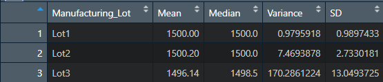

# MechaCar_Statistical_Analysis

All the analyses below are established on the assumption that the significance level is 0.05. 

## Linear Regression to Predict MPG

The R-squared value: 0.7149

Variables|P-values
---------|--------------
vehicle_length|2.60e-12
vehicle_weight|0.0776 
spoiler_angle|0.3069    
ground_clearance|5.21e-08
AWD|0.1852

 - Which variables/coefficients provided a non-random amount of variance to the mpg values in the dataset?
   - After conducting the multiple linear regression analysis on the dataset, the P-values of all independent variables were obtained. The P-values of vehicle_length and ground_clearance are smaller than the significance level we defined (0.05). Therefore, it can be concluded that vehicle_length and ground_clearance provided a non-random amount of variance to the mpg values in the dataset. The results are shown in the images above. 

- Is the slope of the linear model considered to be zero? Why or why not?
  - The slope of the linear model is not zero because the P-values of vehicle_length and ground_clearance are smaller than the significance level we defined (0.05). The coefficients of these two variables are 6.267 and 3.546, respectively.

- Does this linear model predict mpg of MechaCar prototypes effectively? Why or why not?
  -  The R-squared value of this model is 0.7149 which means there is a strong correlation between the model and the dataset. Therefore, this linear model can effectively predict mpg of MechaCar prototypes.

## Summary Statistics on Suspension Coils

Total Summary:

Lot Summary:

- The design specifications for the MechaCar suspension coils dictate that the variance of the suspension coils must not exceed 100 pounds per square inch. Does the current manufacturing data meet this design specification for all manufacturing lots in total and each lot individually? Why or why not?
  - As can be seen in the analysis results above, the variance of the total suspension coils is roughly 62.3 pounds per square inch which is smaller than the threshold of 100 pounds per square inch. The current manufacturing data thus meet this design specification for all manufacturing lots in total.
  - However, the variance of lot 3 is about 170.3pounds per square inch which is much higher than the design specification. Therefore, lot 3 does not meet the design specification.
